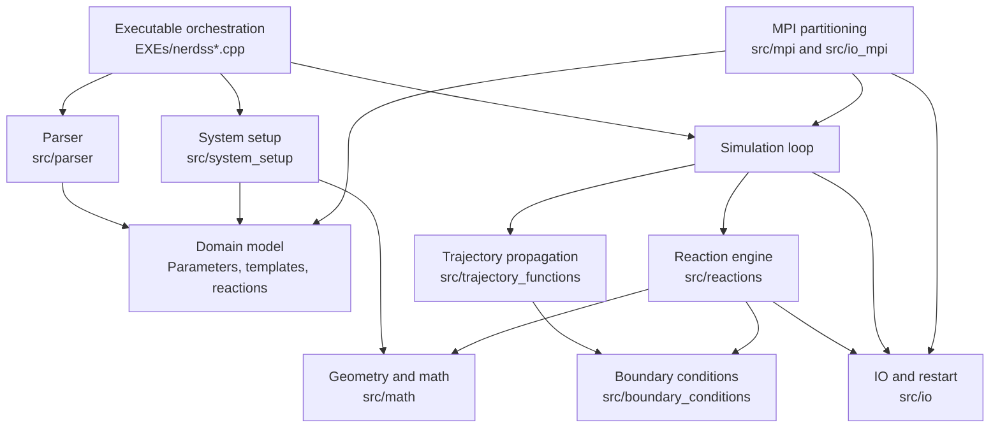

# NERDSS Architecture Map

This map is the Phase 3 domain model and SOLID boundary inventory for the
NERDSS upgrade. It documents current responsibilities and target seams without
changing algorithms, file formats, random-number order, MPI partitioning, or
scientific behavior.

Source context:

- `EXEs/nerdss.cpp` and `EXEs/nerdss_mpi.cpp` currently own executable
  orchestration, setup, file scheduling, and much of the simulation loop.
- Public module headers live under `include/`; implementations live under
  `src/`.
- The refactor plan requires each extraction to be guarded by regression or
  focused tests before behavior is changed.

## Domain Model

The core simulation state is a graph of molecules and complexes, plus
configuration, reactions, counters, geometry, and optional MPI ownership.

| Domain object | Current owners | Primary responsibility | Boundary concern |
| --- | --- | --- | --- |
| `Parameters` | Parser, executables, IO, setup, reactions, trajectory | User input, runtime options, output intervals, some restart state | Also exposes process-wide `Parameters::dt` and `Parameters::lastUpdateTransition`, so functions can depend on hidden time state. |
| `MolTemplate` | Parser, setup, reactions, IO | Molecule type metadata, interface definitions, transition matrices, copy totals | Static `MolTemplate::numMolTypes`, `numEachMolType`, and interface-index maps make template metadata partly global. |
| `Molecule` | Setup, trajectory, reactions, MPI, IO | Runtime molecule coordinates, interfaces, binding partners, complex membership, MPI IDs | Static freelist and ID maps make object lifecycle implicit. Many functions mutate by index into shared vectors. |
| `Complex` | Setup, trajectory, reactions, boundary conditions, MPI, IO | Connected molecule groups, COM, propagation, membership, composition | Static freelist, counters, observables, and ID maps couple lifecycle to all mutation sites. |
| `ForwardRxn`, `BackRxn`, `CreateDestructRxn`, `TransmissionRxn` | Parser, setup, reactions, IO, MPI | Parsed reaction semantics and rate states | Parser constructs and simulation mutates some reaction data in-place; ownership and immutability are not clear. |
| `Membrane` | Parser, setup, reactions, trajectory, boundary conditions, MPI, IO | Boundary geometry, implicit lipid and compartment model state | Acts as both immutable geometry config and mutable lipid/compartment counters. |
| `SimulVolume` | Setup, trajectory, reactions, MPI | Box and subvolume layout, region membership | Used by both physics neighborhood logic and MPI partitioning. |
| `copyCounters` | IO, reactions, setup, MPI | Species, bound-pair, and event counters | Updated as side effects inside reaction and MPI paths. |
| GSL RNG | Executables, `math/rand_gsl.*`, reactions, setup | Random sampling | Process-wide `gsl_rng* r` and `randNum` hide call order behind global functions. |

Target shape: introduce an explicit simulation state boundary before changing
algorithms. A `SimulationContext` can own `Parameters`, molecule and complex
containers, templates, reactions, membrane, volume, counters, RNG access, output
paths, and optional MPI context. The first extraction should be mechanical:
keep the exact order of calls and pass references to existing functions.

## Dependency Diagram

Desired direction is top-down orchestration into domain services. Parser and IO
should build or serialize model state, not call simulation mechanics. Reactions,
trajectory, and boundary conditions are the scientific core and need the
strongest regression guards.

## Boundary Map

### Parser

Current responsibility:

- `parse_command`, `parse_input`, `parse_input_for_add`, restart/add parsing,
  `.mol` parsing, observable parsing, BNGL molecule/reaction parsing, state
  validation, and reaction-list population.
- Directly constructs `Parameters`, `MolTemplate`, reaction lists,
  observables, and `Membrane`.

Boundary issues:

- Lexing, semantic validation, and model construction are interleaved.
- Parser functions accept many mutable output containers, making partial parse
  state visible outside the parser.
- Error handling mixes `std::cerr`, exceptions, and `exit(...)` in callers.
- Parser writes simulation-ready indices directly into template and reaction
  objects, which makes it hard to test parsing without constructing the full
  runtime model.

Target interfaces:

- `InputSource`: file path plus line-preserving content reader.
- `ParsedInput`: immutable parsed representation of parameters, molecule
  definitions, reactions, observables, add-file directives, and coordinate
  references.
- `ModelBuilder`: converts `ParsedInput` to runtime `Parameters`,
  `MolTemplate`, reaction lists, and `Membrane`.
- `ParseDiagnostic`: filename, line, key, severity, and message.

Test seams and guards:

- Golden parser fixtures for small `.inp`, `.mol`, restart, add-file, and BNGL
  reaction snippets.
- Negative fixtures for invalid states, missing molecule files, malformed
  booleans, and incompatible reaction sides.
- Full sample parse smoke over `sample_inputs/VALIDATE_SUITE` to verify old
  syntax remains accepted.

### IO

Current responsibility:

- `src/io` writes trajectories, coordinates, restart files, observables,
  species, PDB/PSF, transition matrices, counters, and human-readable output.
- `src/io_mpi` writes and merges rank-specific outputs.
- `read_restart` reconstructs most simulation containers.

Boundary issues:

- File paths and directory creation are currently orchestrated in executables,
  while individual writers open or append streams inconsistently.
- Restart serialization/deserialization has broad access to every core
  container and encodes model structure as formatted text.
- Writers sometimes take non-const containers even when they appear to only
  inspect state.
- MPI and serial writer variants duplicate output policy.

Target interfaces:

- `OutputSchedule`: write intervals and enabled outputs derived from
  `Parameters`.
- `OutputPaths`: all generated file paths, including rank suffixes.
- `OutputSink`: stream factory for serial and MPI rank-local output.
- `RestartCodec`: explicit serializer/deserializer for simulation snapshots.
- `ReportWriters`: stateless writers that consume read-only snapshot views when
  possible.

Test seams and guards:

- Snapshot round-trip tests for restart read/write.
- Golden header and first-row checks for observables, species, bound-pair, and
  transition outputs.
- Regression comparison for generated restart, trajectory, and counter files on
  fixed-seed validation cases.
- MPI output merge tests using small synthetic rank files before touching MPI
  runtime behavior.

### System Setup

Current responsibility:

- Coordinate generation for new and restart simulations.
- Molecule/complex initialization, copy-number state initialization, shape
  determination, `rMaxLimit`, excluded-volume metadata, and implicit
  lipid/compartment setup.

Boundary issues:

- Setup is mixed with random placement, geometry validation, template mutation,
  complex construction, and membrane initialization.
- Coordinate generation mutates molecule/complex lists and relies on RNG
  globals through lower-level functions.
- Restart add-file setup overlaps with new-simulation setup but has separate
  state counters and index offsets.

Target interfaces:

- `InitialModel`: parsed and validated templates, reactions, and parameters.
- `PlacementStrategy`: serializes current random-placement behavior behind an
  injected RNG while preserving draw order.
- `SystemInitializer`: returns initialized molecules, complexes, volume,
  membrane, counters, and derived metadata.
- `RestartAugmenter`: adds molecules/reactions to a restart snapshot with
  explicit before/after index ranges.

Test seams and guards:

- Fixed-seed coordinate generation baselines for box, sphere, membrane, and
  implicit-lipid examples.
- Invariant tests after setup: molecule indices match vector positions, complex
  member lists match molecule `myComIndex`, template copy totals match live
  molecules, and membrane state vectors have expected lengths.
- Restart-add regression comparing output from existing sample add flows.

### Reactions

Current responsibility:

- Bimolecular reaction selection and probability evaluation.
- Association geometry and rotations.
- Dissociation, state changes, creation/destruction, transmission, implicit
  lipid reactions, compartment entry/exit, event tracking, counters, and
  structure-overlap checks.

Scientific algorithms live here:

- Association orientation and rotation math.
- 1D, 2D, 3D, implicit-lipid, and compartment probability calculations.
- Dissociation and rebinding correction logic.
- Binding/unbinding state transitions and complex topology updates.

Boundary issues:

- Probability calculations, random draws, topology mutation, observables,
  event counters, and optional file output are often in the same call chain.
- Many functions take `Parameters`, all molecule/complex/template/reaction
  containers, observables, counters, `Membrane`, and sometimes MPI state.
- Box, sphere, compartment, membrane, cluster, and implicit-lipid variants
  duplicate control flow.
- Static freelists and template copy counters are mutated during creation,
  dissociation, association, and cleanup.

Target interfaces:

- `ReactionCatalog`: immutable reaction definitions and lookup tables.
- `ReactionNeighborhood`: candidate molecule/interface pairs for this step.
- `ReactionProbabilityService`: pure or nearly pure probability calculations.
- `ReactionExecutor`: applies chosen reaction mutations to state.
- `TopologyEditor`: owns molecule/complex binding, splitting, merging,
  freelist updates, and copy-count changes.
- `ReactionEventLog`: association/dissociation and observable updates.

Test seams and guards:

- Pure numeric unit tests for `passocF`, `passocF_1D`, `pirr`/survival/norm
  table calculations, and implicit-lipid probability helpers.
- Topology invariant tests around association, dissociation, creation,
  destruction, and transmission on tiny hand-built systems.
- Fixed-seed regression tests for each reaction family before moving random
  draws or loop order.
- Microbenchmarks for candidate search and association/dissociation hotspots
  after behavior is pinned.

### Trajectory

Current responsibility:

- Complex propagation vector generation.
- Translation and rotation updates for complexes and member molecules.
- Separation sweeps after propagation for solution, box, sphere, membrane,
  fiber, and cluster variants.
- Reweight vector clearing.

Scientific algorithms live here:

- Brownian translational and rotational propagation.
- Sphere-surface propagation.
- Overlap resampling and propagated-status behavior.

Boundary issues:

- Propagation generation consumes the global RNG and mutates complexes and
  molecules directly.
- Geometry-specific variants duplicate many signatures.
- Sweep functions combine overlap detection, reaction proximity, and trajectory
  status updates.

Target interfaces:

- `PropagationService`: computes displacement/rotation from diffusion,
  timestep, geometry, and RNG.
- `MotionApplier`: applies a motion to complexes and molecules.
- `OverlapDetector`: read-only separation checks by geometry mode.
- `PropagationPolicy`: selects box, sphere, membrane, fiber, compartment, or
  cluster behavior without scattering variant names through callers.

Test seams and guards:

- Fixed-seed propagation snapshots for one free molecule and one multi-molecule
  complex in box and sphere modes.
- Deterministic geometry tests for overlap/separation with hand-placed
  molecules.
- Regression guard on RNG draw counts for propagation paths before and after
  extraction.

### Boundary Conditions

Current responsibility:

- Reflect dissociation moves, propagation moves, temporary association
  coordinates, and span checks for box, sphere, and compartment geometries.

Scientific algorithms live here:

- Reflecting boundary behavior and association cancellation when complexes span
  disallowed regions.

Boundary issues:

- Boundary functions use the same mutable molecule/complex containers as
  trajectory and reactions, so it is difficult to isolate geometry behavior.
- Box, sphere, and compartment variants duplicate signatures and behavior.
- Some functions both check and repair state, while others only report
  cancellation through mutable reference parameters.

Target interfaces:

- `BoundaryPolicy`: common interface for reflect, span check, and temporary
  coordinate correction.
- `BoundaryResult`: explicit result with accepted/canceled flag, corrected
  trajectory, and diagnostics.
- `GeometrySnapshot`: read-only view of dimensions, sphere radius, membrane, and
  compartment settings.

Test seams and guards:

- Table-driven geometry tests for reflection at each face/axis and sphere
  radius.
- Regression tests for association cancellation near boundaries.
- Fixed-seed smoke tests for samples that exercise box, sphere, and compartment
  paths.

### Math

Current responsibility:

- Coordinates, vectors, quaternions, matrices, Faddeeva functions, constants,
  and GSL RNG wrapper functions.

Boundary issues:

- General math and process-global RNG are in the same module area.
- `rand_gsl` exposes free functions backed by global `gsl_rng* r`, making
  deterministic tests hard to isolate.
- Matrix ownership uses raw `gsl_matrix*` vectors in reaction probability
  tables.

Target interfaces:

- `RandomNumberStream`: minimal wrapper around GSL with explicit ownership,
  seed, state read/write, and existing distribution functions.
- `ReactionTableCache`: RAII owner for norm, survival, and pir matrices plus
  table IDs.
- Keep coordinate, vector, quaternion, and matrix helpers independent from
  simulation containers.

Test seams and guards:

- RNG state serialization tests that prove restartable streams match current
  `gsl_rng_fwrite`/`gsl_rng_fread` behavior.
- Numeric tolerance tests for math helpers and table caches.
- Leak/sanitizer guard around GSL matrix allocation and cleanup.

### MPI

Current responsibility:

- Rank setup, subvolume partitioning, molecule and complex serialization,
  neighbor exchange, ghost/shared-zone handling, rank-local deletion, ID/index
  mapping, and MPI output/merge behavior.

Boundary issues:

- `EXEs/nerdss_mpi.cpp` duplicates large portions of serial orchestration while
  interleaving `MPI_*` calls, output scheduling, and simulation-loop mechanics.
- Serialization mutates ID/index maps and molecule/complex ownership as part of
  communication.
- Rank ownership rules are distributed across MPI helpers, `SimulVolume`, and
  molecule flags.
- MPI functions use raw buffers and manual byte offsets.

Target interfaces:

- `MpiRuntime`: owns MPI init/finalize, rank, size, wall-clock timers, and
  communicator access.
- `PartitionService`: maps coordinates to rank/subvolume ownership.
- `RankExchange`: serializes, sends, receives, and deserializes exchange
  packets.
- `OwnershipPolicy`: answers local, ghosted, shared-zone, and output ownership.
- `ExchangePacket`: typed representation before conversion to legacy byte
  buffers.

Test seams and guards:

- Non-MPI unit tests for serialization round trips on molecule/complex packets.
- Single-rank MPI smoke that matches serial output for a tiny fixed-seed input
  where supported.
- Two-rank smoke for boundary-crossing molecule exchange, validating ownership
  and no duplicate owned output.
- Regression guard for MPI rank-local file names and merged output.

### Executable Orchestration

Current responsibility:

- Parse command line.
- Create directories and output files.
- Allocate core containers and GSL tables.
- Parse input or restart state.
- Initialize system metadata.
- Run the simulation loop.
- Schedule trajectory, restart, observables, PDB, counters, and debug output.
- Call MPI setup/exchange in the MPI executable.
- Free RNG and finish process.

Boundary issues:

- `main` is the composition root, simulation service, output scheduler, setup
  coordinator, and error boundary all at once.
- Serial and MPI executables duplicate large lifecycle phases.
- Stack-local state is passed through long parameter lists rather than grouped
  by ownership or purpose.
- Direct `exit(...)` in lower-level code prevents orchestration from presenting
  structured errors or cleaning up.

Target interfaces:

- `CommandLineOptions`: parsed CLI options and seed.
- `SimulationContext`: explicit owner of mutable simulation state.
- `SimulationRunner`: setup, loop, and teardown in callable units.
- `StepExecutor`: one timestep with explicit ordered phases.
- `OutputScheduler`: all write decisions for the current step.
- `ErrorBoundary`: converts domain errors into exit codes and messages.

Test seams and guards:

- Smoke tests that instantiate setup and run a very small fixed-seed simulation
  without going through `main`.
- Regression comparison of serial executable outputs before and after each
  orchestration extraction.
- RNG-sequence guard around main-loop extraction: same seed, same output files,
  same restart state.

## Global State Inventory

| State | Location | Consumers | Risk | Target owner |
| --- | --- | --- | --- | --- |
| `gsl_rng* r` | `EXEs/nerdss.cpp`, `EXEs/nerdss_mpi.cpp`; declared in `include/math/rand_gsl.hpp` | `rand_gsl.*`, reactions, setup, trajectory | Hidden RNG draw order blocks isolated tests and parallel reproducibility checks. | `RandomNumberStream` inside `SimulationContext`; pass as dependency while preserving call order. |
| `long long randNum` | Executables; declared in `rand_gsl.hpp` | RNG wrapper | Hidden mutable counter/state. | RNG wrapper. |
| `unsigned long totMatches` | Executables; declared in `class_Rxns.hpp`; incremented in reaction lookup | Parser/reaction diagnostics | Cross-cutting debug counter affects observability without clear reset. | Metrics/debug state owned by context. |
| `Parameters::dt` | `class_Parameters.*`; set in executables | Reactions and transition updates | Duplicate of `params.timeStep` hides dependence on current timestep. | Explicit `SimulationClock` or context-owned timestep. |
| `Parameters::lastUpdateTransition` | `class_Parameters.*`; resized in executables | Association/dissociation transition matrices | Global vector keyed by molecule type, mutated in reaction code. | Transition tracker service/counters. |
| `MolTemplate::numMolTypes` | `class_MolTemplate.*`; set in executables and restart/setup paths | Complex initialization and parser/setup | Template count is both global metadata and local list size. | Model metadata or context. |
| `MolTemplate::numEachMolType` | `class_MolTemplate.*`; updated on creation/deletion | Setup/reactions/IO | Copy totals can diverge from molecule list after partial mutation. | `TopologyEditor` and counters. |
| `MolTemplate::absToRelIface`, `molKeywords` | `class_MolTemplate.hpp` | Parser and reaction indexing | Parser lookup state is static and hard to reset between tests. | Parser/model-builder local lookup tables. |
| `Molecule::emptyMolList` | `class_Molecule_Complex.*` | Creation, deletion, cleanup, MPI | Freelist is process-global and can retain stale indices between runs/tests. | Container-owned freelist in topology state. |
| `Molecule::numberOfMolecules`, `maxID`, `mapIdToIndex` | `class_Molecule_Complex.hpp` | Setup, MPI, serialization | ID allocation and local index mapping are global. | `MoleculeStore` and MPI ownership map. |
| `Complex::emptyComList` | `class_Molecule_Complex.*` | Association, dissociation, cleanup, MPI | Same lifecycle risk as molecule freelist. | `ComplexStore`/`TopologyEditor`. |
| `Complex::numberOfComplexes`, `currNumberComTypes`, `currNumberMolTypes`, `obs`, `maxID`, `mapIdToIndex` | `class_Molecule_Complex.hpp` | IO, reactions, MPI | Mixes observables, ID allocation, and type counts in global state. | Context metrics plus stores. |
| Raw `gsl_matrix*` vectors and `double* tableIDs` | Executables and reactions | 2D reaction table calculations | Manual ownership and cleanup risk; hard to test cache behavior. | `ReactionTableCache`. |

## Ownership Risks

1. Container index identity is fragile. Molecules and complexes are referenced
   by vector index, object `index`, partner IDs, complex membership, and MPI
   IDs. Any compaction or freelist change must update all references.
2. Freelist ownership is global. Creation, destruction, association,
   dissociation, restart-add, and MPI deletion all update empty-slot lists.
3. Template counts and live molecules can drift. `MolTemplate::numEachMolType`,
   complex `numEachMol`, copy counters, and observable maps all represent
   overlapping truths.
4. Reactions own both immutable definitions and mutable runtime tables/counters.
   This complicates reuse in parser tests and restart snapshots.
5. `Membrane` mixes geometry configuration with mutable implicit-lipid and
   compartment state.
6. IO streams are sometimes opened in orchestration and sometimes in domain
   functions, so output side effects can occur inside scientific algorithms.
7. MPI ownership and local vector indices are coupled. Rank exchange can alter
   molecule/complex identity while the simulation loop still holds local
   indices.
8. Error exits below `main` can skip cleanup and make negative tests process
   fatal.

## SOLID Refactor Boundaries

Single responsibility:

- Split parser lexing/validation/model construction.
- Split reaction probability, reaction decision, topology mutation, and event
  logging.
- Split trajectory motion generation from motion application.
- Split boundary checking from boundary repair.
- Split output scheduling from file writing.

Open/closed:

- Replace geometry suffix proliferation (`_box`, `_sphere`, `_compartment`) with
  policy objects after regression coverage exists.
- Add output formats through writer interfaces rather than new branches in
  orchestration.

Liskov substitution:

- Geometry and boundary policies should preserve existing preconditions:
  molecule/complex coordinates in, accepted/canceled/corrected result out.
  Do not introduce base classes until behavior is well characterized.

Interface segregation:

- Avoid passing full `SimulationContext` into low-level numeric helpers.
  Probability functions need parameters, reaction data, distances, and table
  caches, not IO streams or MPI state.
- Writers should receive read-only snapshot views unless they intentionally
  update counters.

Dependency inversion:

- Orchestration should depend on parser, setup, runner, output, and MPI
  interfaces.
- Scientific code should depend on small services: RNG stream, table cache,
  topology editor, and boundary policy.
- MPI should depend on typed snapshots/packets, not direct knowledge of every
  parser or IO detail.

## Refactor Priority Order

| Priority | Extraction | Risk | Why first | Guard required |
| --- | --- | --- | --- | --- |
| P0 | Add regression and smoke guards around small fixed-seed serial examples | Low code risk, high process value | Required dependency for later Phase 3/4 work. | Baseline output bundle and documented compare command. |
| P1 | Create `SimulationContext` as a passive grouping in orchestration | Medium | Reduces parameter threading without moving algorithms. | Same fixed-seed outputs and restart files as current serial executable. |
| P2 | Extract output paths and `OutputScheduler` from serial and MPI mains | Low-medium | Separates IO policy from scientific loop; easiest visible duplication. | Golden output file names, headers, and write cadence checks. |
| P3 | Wrap RNG in `RandomNumberStream` while keeping `rand_gsl()` compatibility | High | Enables deterministic unit tests but can disturb call order. | RNG state round-trip tests and fixed-seed trajectory/reaction regression. |
| P4 | Extract parser `ParsedInput` and diagnostics behind existing parser entry points | Medium | Parser has many format branches but lower scientific risk than reactions. | Fixture parse tests plus all sample inputs still parse. |
| P5 | Introduce `TopologyEditor` for molecule/complex lifecycle and freelists | High | Attacks central ownership risk shared by reactions, setup, restart, and MPI. | Topology invariant tests after association, dissociation, creation, deletion, restart-add, and MPI deserialization. |
| P6 | Extract `ReactionProbabilityService` and `ReactionTableCache` | High scientific risk | Gives pure seams around equations and raw GSL matrix ownership. | Numeric unit tests, fixed-seed reaction outputs, and sanitizer run. |
| P7 | Extract boundary and propagation policies by geometry | High scientific risk | Reduces variant duplication and clarifies physics seams. | Geometry table tests and fixed-seed samples for box, sphere, membrane, and compartment. |
| P8 | Align serial and MPI runner lifecycles behind shared orchestration | High MPI risk | Removes duplicate main-loop structure only after state ownership is explicit. | Serial-vs-single-rank smoke, two-rank exchange smoke, and rank output merge regression. |

## Immediate Agent H Handoff

For main-loop extraction, start with a no-behavior-change context:

- Move stack-local containers from `EXEs/nerdss.cpp` into a passive
  `SimulationContext` struct local to orchestration code.
- Keep existing free functions and call order.
- Do not replace `rand_gsl()` or static counters in the same change.
- Extract setup phases first, then output initialization, then one timestep.
- Run fixed-seed regression after every extraction step.

Do not start with reaction, boundary, or RNG rewrites. Those areas are the
scientific core and need more targeted tests before structural movement.
